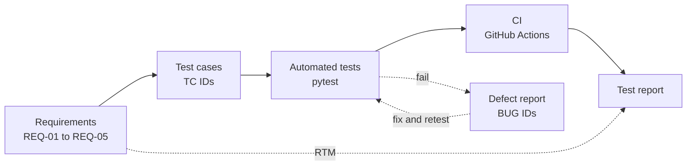
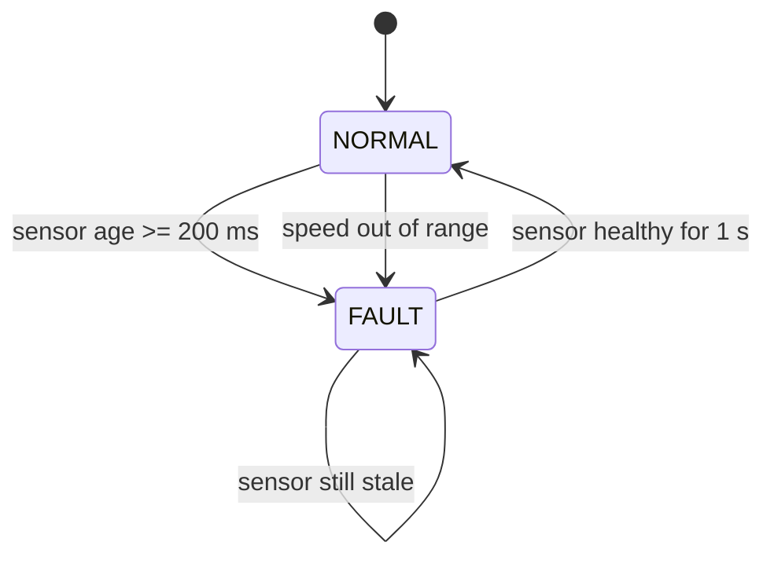

<div align="center">

# automotive-sw-qa

**End-to-end software QA for an automotive safety function,<br>from requirements to an automated regression suite.**

[](https://github.com/eungyun-im/automotive-sw-qa/actions/workflows/test.yml)


[Overview](#overview) · [Requirements](#requirements) · [Test design](#test-design) · [Traceability](#traceability) · [Layout](#repository-layout) · [Run](#running-the-tests)

</div>

---

## Overview

The system under test is **AEB-lite**, a simplified Automatic Emergency Braking decision function. It takes vehicle speed, obstacle distance, and sensor data age, and returns one of three actions: `BRAKE`, `NO_ACTION`, or `FAULT`.

Every artifact in this repository traces back to the same five requirements: the test cases, the automated tests, the defect reports, and the final test report.

> **Status:** work in progress. The structure, requirements, and test case list are in place. The implementation and the automated tests are being filled in.



## Requirements

| ID | Condition | Output |
|---|---|---|
| REQ-01 | Speed ≥ 30 km/h, obstacle ≤ 20 m, sensor data valid | `BRAKE` |
| REQ-02 | Speed < 30 km/h | `NO_ACTION` |
| REQ-03 | Sensor data age ≥ 200 ms | `FAULT` |
| REQ-04 | In `FAULT`, sensor healthy for 1 s | back to `NORMAL` |
| REQ-05 | Speed outside 0 to 250 km/h | `FAULT` |

Full spec: [`requirements/aeb_requirements.md`](requirements/aeb_requirements.md)



## Test design

Four techniques, each chosen for the part of the requirements it fits.

| Technique | Applied to | Example |
|---|---|---|
| Equivalence partitioning | Speed and distance ranges | below 0 · 0 to 30 · 30 to 250 · above 250 km/h |
| Boundary value analysis | Every threshold | 29.9 / 30.0 / 30.1 km/h · 20.0 / 20.1 m · 199 / 200 ms |
| Decision table | REQ-01, 02, 05 | see below |
| State transition | REQ-03, 04 | `NORMAL` ↔ `FAULT` |

**Decision table**

| | R1 | R2 | R3 | R4 |
|---|:-:|:-:|:-:|:-:|
| Speed in valid range | N | Y | Y | Y |
| Speed ≥ 30 km/h | – | N | Y | Y |
| Obstacle ≤ 20 m | – | – | N | Y |
| **Output** | `FAULT` | `NO_ACTION` | `NO_ACTION` | `BRAKE` |

Test case list: [`testcases/aeb_testcases.csv`](testcases/aeb_testcases.csv)

## Traceability

Each automated test carries its test case ID as the pytest ID, so a CI result maps directly onto a row of the traceability matrix.

| Requirement | Test cases | Automated in |
|---|---|---|
| REQ-01 | TC-01 to TC-06 | `tests/test_aeb.py::test_brake_decision` |
| REQ-02 | TC-11, TC-12 | `tests/test_aeb.py::test_brake_decision` |
| REQ-03 | TC-21, TC-22 | `tests/test_aeb.py::test_sensor_timeout` |
| REQ-04 | TC-31 onward | planned |
| REQ-05 | TC-41, TC-42 | `tests/test_aeb.py::test_invalid_speed` |

Matrix: [`requirements/rtm.csv`](requirements/rtm.csv)

## What it covers

| Area | Artifact |
|---|---|
| Requirements and traceability | [`requirements/`](requirements) |
| Test design | [`testcases/`](testcases) |
| Unit and regression testing | [`tests/test_aeb.py`](tests/test_aeb.py) |
| Continuous integration | [`.github/workflows/test.yml`](.github/workflows/test.yml) |
| API testing | [`tests/api/`](tests/api) |
| In-vehicle network diagnostics | [`sim/ecu_sim.py`](sim/ecu_sim.py), [`tests/can/`](tests/can) |
| Defect management | [`bug_reports/`](bug_reports) |
| Functional safety and process | [`docs/`](docs) |
| AI-assisted testing | [`docs/llm_tc_review.md`](docs/llm_tc_review.md) |

## Repository layout

```
automotive-sw-qa/
├── requirements/        Requirement spec and traceability matrix
├── testcases/           Test case list
├── src/aeb.py           AEB-lite decision logic
├── sim/ecu_sim.py       Virtual UDS ECU (vcan0)
├── tests/
│   ├── test_aeb.py      Decision logic tests
│   ├── api/             API tests
│   └── can/             UDS tests
├── bug_reports/         Defect reports
├── docs/                Test plan, test report, safety analysis
└── .github/workflows/   CI
```

## Running the tests

```bash
pip install -r requirements.txt
pytest -m "not network and not can" -v
```

| Marker | Purpose | Needs |
|---|---|---|
| `smoke` | Fast checks | nothing extra |
| `regression` | Full requirement coverage | nothing extra |
| `network` | API tests | internet access |
| `can` | UDS tests | Linux `vcan0` with `sim/ecu_sim.py` running |

## Standards referenced

ISTQB CTFL v4.0 · ISO 26262 · Automotive SPICE (SWE.1 to SWE.6) · ISO 14229 (UDS)
