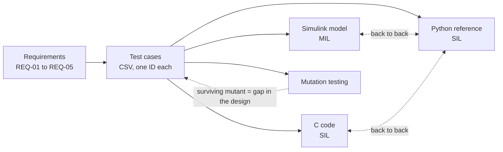
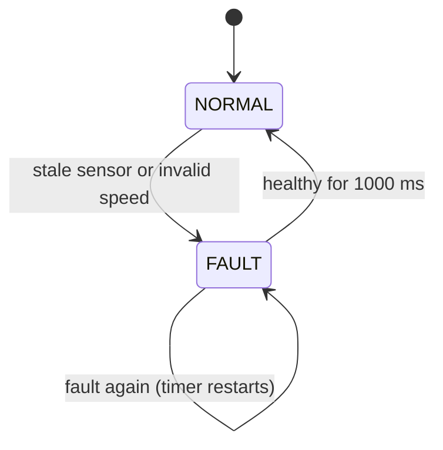
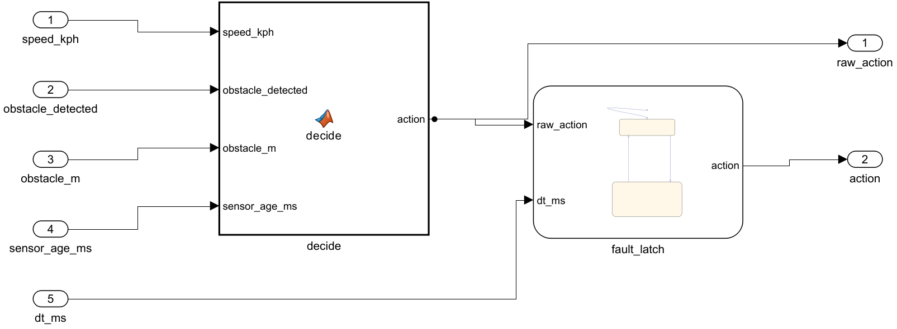
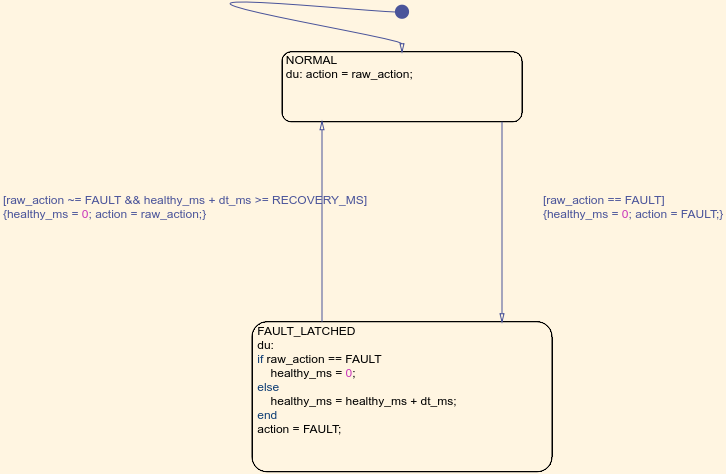
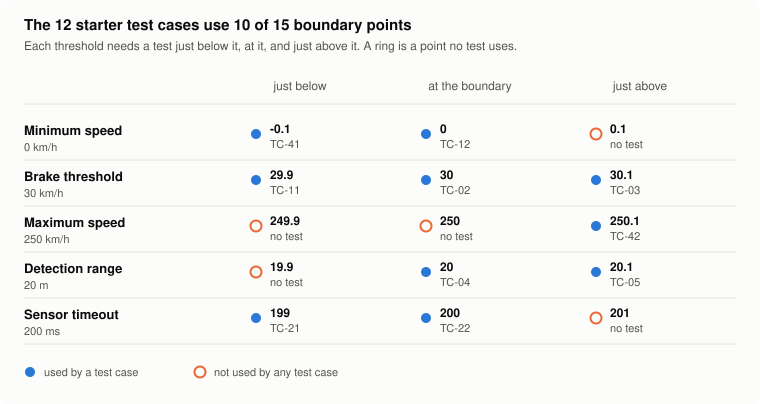

<div align="center">

# automotive-sw-qa

**Requirement-based testing of an automotive safety function,<br>across model, C code and reference, with the test design itself put under measurement.**

[](https://github.com/eungyun-im/automotive-sw-qa/actions/workflows/test.yml)


[Overview](#overview) · [Requirements](#requirements) · [Test design](#test-design) · [Model, code, reference](#model-code-reference) · [Measuring the tests](#measuring-the-tests) · [Layout](#repository-layout) · [Run](#running)

</div>

---

## Overview

The system under test is **AEB-lite**, a simplified Automatic Emergency Braking decision function. It takes vehicle speed, obstacle distance and sensor data age, and returns `BRAKE`, `NO_ACTION` or `FAULT`.

The repository follows one thread from requirement to evidence:

- Test cases are **designed in CSV files**, traced to requirements. Code only executes them.
- The same test cases run on three implementations of the function: a **Simulink/Stateflow model**, **C code**, and a **Python reference**. Their outputs are compared back to back.
- The test design is then measured: which code it executes (coverage, up to MC/DC on the model) and which code changes it would notice (mutation testing).

> **Status:** the three implementations, the test runner, the traceability matrix, the mutation tool and the static analysis are in place and run in CI. The test case list is a starter set of 12. Extending it, covering REQ-04, and writing the defect and test reports are open.



## Requirements

| ID | Condition | Output |
|---|---|---|
| REQ-01 | Speed ≥ 30 km/h, obstacle ≤ 20 m, sensor data valid | `BRAKE` |
| REQ-02 | Speed < 30 km/h | `NO_ACTION` |
| REQ-03 | Sensor data age ≥ 200 ms | `FAULT` |
| REQ-04 | In `FAULT`, inputs healthy for 1 s | back to `NORMAL` |
| REQ-05 | Speed outside 0 to 250 km/h | `FAULT` |

Full spec and design decisions: [`requirements/aeb_requirements.md`](requirements/aeb_requirements.md)



While latched in `FAULT`, the output stays `FAULT` even when the inputs would otherwise call for `BRAKE`.

## Test design

| Technique | Applied to | Example |
|---|---|---|
| Equivalence partitioning | Speed and distance ranges | below 0 · 0 to 30 · 30 to 250 · above 250 km/h |
| Boundary value analysis | Every threshold | 29.9 / 30.0 / 30.1 km/h · 20.0 / 20.1 m · 199 / 200 ms |
| Decision table | REQ-01, 02, 05 | see below |
| State transition | REQ-03, 04 | `NORMAL` ↔ `FAULT` as timed sequences |

**Decision table**

| | R1 | R2 | R3 | R4 |
|---|:-:|:-:|:-:|:-:|
| Speed in valid range | N | Y | Y | Y |
| Speed ≥ 30 km/h | – | N | Y | Y |
| Obstacle ≤ 20 m | – | – | N | Y |
| **Output** | `FAULT` | `NO_ACTION` | `NO_ACTION` | `BRAKE` |

The test cases live in two files, described in [`testcases/README.md`](testcases/README.md):

- [`aeb_testcases.csv`](testcases/aeb_testcases.csv): one row per test of the stateless decision.
- [`aeb_sequences.csv`](testcases/aeb_sequences.csv): timed sequences for the fault latch.

Adding a row adds a test on all three implementations. No code changes are needed.

The traceability matrix is generated from these files with `python -m tools.rtm` and stored as [`requirements/rtm.csv`](requirements/rtm.csv). REQ-01, 02, 03 and 05 are covered; REQ-04 has no test case yet. A test case that cites an unknown requirement fails CI.

## Model, code, reference

| Implementation | Level | Where | How the test cases reach it |
|---|---|---|---|
| Simulink model with a Stateflow chart for the fault latch | MIL | [`matlab/`](matlab) | `run_mil.m` simulates one step per test row |
| C99 code | SIL | [`src/c/`](src/c) | pytest calls the compiled library through `ctypes` |
| Python reference | SIL | [`src/aeb.py`](src/aeb.py) | pytest calls it directly |

The model: a MATLAB Function block for the decision, and a Stateflow chart for the fault latch.





**Back-to-back results**

| Comparison | Inputs | Result |
|---|---|---|
| C code vs Python reference | 504-point boundary grid, 200 random timed sequences | identical, checked on every CI run |
| Simulink model vs Python reference | 504 decision cases, 1500 sequence samples generated from the reference | identical (run in MATLAB R2025b) |
| Simulink model vs designed test cases | 12 test cases | 12 passed |

CI has no MATLAB. The model outputs are stored in [`matlab/results/mil_results.csv`](matlab/results/mil_results.csv), and CI replays every stored input through the Python reference, so a model that disagrees with the code still fails the build.

The C code is written by hand, not generated from the model. Agreement between them shows that both follow the same requirements.

**Static analysis of the C code.** The build uses `-Wall -Wextra -Wpedantic -Wconversion -Wshadow -Werror`, and cppcheck gates CI with no findings. A MISRA C:2012 check with the cppcheck addon reports two advisory findings, both documented as deviations in [`docs/static_analysis.md`](docs/static_analysis.md). The addon covers a subset of MISRA and is not a qualified checker.

## Measuring the tests

**Structural coverage** with the 12 starter test cases:

| Artifact | Metric | Result |
|---|---|---|
| Python reference | Branch | 100 % |
| C code | Branch | 100 % (including harness checks for NULL and overflow) |
| Simulink model | Decision | 86.7 % (13 of 15) |
| Simulink model | Condition | 78.6 % (11 of 14) |
| Simulink model | MC/DC | 71.4 % (5 of 7) |

The model numbers are lower because they include the fault latch, which has no designed test case yet, and because MC/DC asks more than branch coverage does. Inputs generated from the reference reach 100 % on all three model metrics, so the gap is in the test design and can be closed.

**Mutation testing** asks a different question. The tool makes one small change to the decision logic at a time (`>=` to `>`, `30.0` to `31.0`, `and` to `or`, a different return value) and reruns the test cases. A change no test notices is a surviving mutant.

```bash
python -m tools.mutation
```

| | |
|---|---|
| Mutants generated | 25 |
| Killed | 23 |
| Survived | 2 |
| Mutation score | 92 % |

Both survivors sit on the same boundary: the upper speed limit can change from `<= 250.0` to `< 250.0`, or from `250.0` to `249.0`, and every test still passes. The set tests 250.1 km/h but never 250.0. Full branch coverage did not reveal that. The mutation report did, and it names the missing test.

The same gap is visible when the test cases are laid against the boundary points of the spec:

<picture>
  <source media="(prefers-color-scheme: dark)" srcset="docs/img/boundary-points-dark.svg">
  
</picture>

Regenerated from the test case file with `python -m tools.figures`.

Equivalent mutants are not excluded, so the score is a lower bound. The report is regenerated on every CI run.

## Repository layout

```
automotive-sw-qa/
├── requirements/
│   ├── aeb_requirements.md   Requirement spec and design decisions
│   └── rtm.csv               Traceability matrix (generated)
├── testcases/                Test design: CSV files and their format
├── matlab/
│   ├── build_model.m         Builds the Simulink model from a script
│   ├── run_mil.m             Simulates the model with the test cases, measures coverage
│   ├── aeb_model.slx         The model
│   └── results/              Stored model outputs and coverage summary
├── src/
│   ├── c/aeb.c, aeb.h        C implementation
│   └── aeb.py                Python reference
├── tests/
│   ├── test_aeb.py           Test cases on the Python reference
│   ├── test_aeb_c.py         Test cases on the C code
│   ├── test_aeb_sequences.py Timed sequences
│   ├── test_back_to_back.py  C vs Python, model vs Python
│   ├── test_controller.py    Implementation checks for the fault latch
│   └── test_traceability.py  Consistency of test cases and requirements
├── tools/
│   ├── caeb.py               Builds the C library and wraps it for Python
│   ├── model_check.py        Generates check inputs for the model
│   ├── rtm.py                Traceability matrix
│   ├── mutation.py           Mutation testing
│   └── testcases.py          CSV loading
├── bug_reports/              Defect report template
├── docs/                     Test plan, verification levels, static analysis, HARA, test report
└── .github/workflows/        CI: tests, coverage, static analysis, RTM, mutation report
```

## Running

Python and C (needs gcc; the C tests are skipped without it):

```bash
pip install -r requirements.txt
pytest -v --cov=src --cov-branch
```

Model in the loop (needs MATLAB with Simulink, Stateflow and Simulink Coverage), from the `matlab` folder:

```matlab
run_mil
```

| Marker | Selects |
|---|---|
| `smoke` | High-priority test cases |
| `regression` | Every designed test case |
| `c` | Tests that run the C code |

## Roadmap

**Core**

- [x] AEB-lite decision logic and fault latch in Python, C and Simulink/Stateflow
- [x] Data-driven tests, one pytest ID per test case
- [x] Back-to-back comparison of the three implementations
- [x] Generated traceability matrix
- [x] Coverage, mutation testing and static analysis in CI
- [x] Test plan
- [ ] Full test case list from the four design techniques, with every mutant killed or explained and MC/DC of the model closed
- [ ] REQ-04 sequence test cases
- [ ] Defect reports with reproduction steps and root cause
- [ ] Test report

**Later**

- [ ] C code generated from the model with Embedded Coder, compared with the hand-written code
- [ ] HARA traced to safety requirements and tests
- [ ] API tests against a mock vehicle control service

## Standards referenced

ISTQB CTFL v4.0 · ISO 26262-6 · MISRA C:2012 · Automotive SPICE (SWE.1, SWE.3, SWE.4)

## Related

- [ecu-quality-gate](https://github.com/eungyun-im/ecu-quality-gate): release gate for ECU software with UDS diagnostics, network and security checks
- [llm-testcase-review](https://github.com/eungyun-im/llm-testcase-review): execution-based evaluation of LLM-written test cases for this same function
