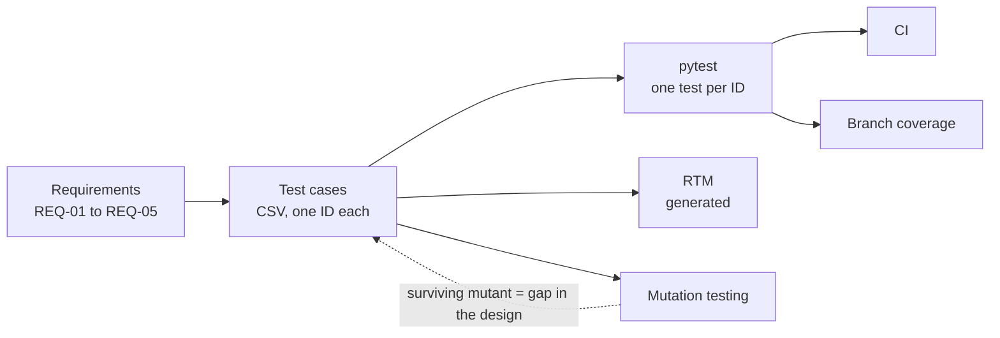
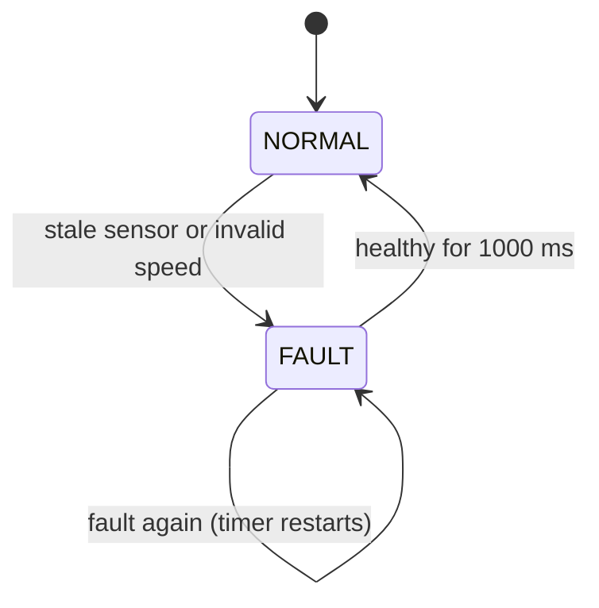

<div align="center">

# automotive-sw-qa

**Requirement-based testing of an automotive safety function,<br>with the test design itself put under measurement.**

[](https://github.com/eungyun-im/automotive-sw-qa/actions/workflows/test.yml)


[Overview](#overview) · [Requirements](#requirements) · [Test design](#test-design) · [Traceability](#traceability) · [Measuring the tests](#measuring-the-tests) · [Layout](#repository-layout) · [Run](#running)

</div>

---

## Overview

The system under test is **AEB-lite**, a simplified Automatic Emergency Braking decision function. It takes vehicle speed, obstacle distance and sensor data age, and returns `BRAKE`, `NO_ACTION` or `FAULT`.

The repository follows one thread from requirement to evidence:

- Test cases are **designed in CSV files**, traced to requirements. Code only executes them.
- Each test case runs as one pytest test whose ID is the test case ID.
- The test design is then checked two ways: which code it executes (branch coverage) and which code changes it would notice (mutation testing).

> **Status:** the decision logic, the test runner, the traceability matrix and the mutation tool are implemented and run in CI. The test case list is a starter set. Extending it, covering REQ-04, and writing the defect and test reports are open.



## Requirements

| ID | Condition | Output |
|---|---|---|
| REQ-01 | Speed ≥ 30 km/h, obstacle ≤ 20 m, sensor data valid | `BRAKE` |
| REQ-02 | Speed < 30 km/h | `NO_ACTION` |
| REQ-03 | Sensor data age ≥ 200 ms | `FAULT` |
| REQ-04 | In `FAULT`, inputs healthy for 1 s | back to `NORMAL` |
| REQ-05 | Speed outside 0 to 250 km/h | `FAULT` |

Full spec and design decisions: [`requirements/aeb_requirements.md`](requirements/aeb_requirements.md)



While latched in `FAULT`, the output stays `FAULT` even when the inputs would otherwise call for `BRAKE`.

## Test design

| Technique | Applied to | Example |
|---|---|---|
| Equivalence partitioning | Speed and distance ranges | below 0 · 0 to 30 · 30 to 250 · above 250 km/h |
| Boundary value analysis | Every threshold | 29.9 / 30.0 / 30.1 km/h · 20.0 / 20.1 m · 199 / 200 ms |
| Decision table | REQ-01, 02, 05 | see below |
| State transition | REQ-03, 04 | `NORMAL` ↔ `FAULT` as timed sequences |

**Decision table**

| | R1 | R2 | R3 | R4 |
|---|:-:|:-:|:-:|:-:|
| Speed in valid range | N | Y | Y | Y |
| Speed ≥ 30 km/h | – | N | Y | Y |
| Obstacle ≤ 20 m | – | – | N | Y |
| **Output** | `FAULT` | `NO_ACTION` | `NO_ACTION` | `BRAKE` |

The test cases live in two files, described in [`testcases/README.md`](testcases/README.md):

- [`aeb_testcases.csv`](testcases/aeb_testcases.csv): one row per test of the stateless decision.
- [`aeb_sequences.csv`](testcases/aeb_sequences.csv): timed sequences for the fault latch.

Adding a row adds a test. No Python changes are needed.

## Traceability

The matrix is generated from the test case files, so it cannot drift from them:

```bash
python -m tools.rtm
```

| Requirement | Test cases | Covered |
|---|---|---|
| REQ-01 | TC-01 to TC-06 | yes |
| REQ-02 | TC-11, TC-12 | yes |
| REQ-03 | TC-21, TC-22 | yes |
| REQ-04 | none yet | no |
| REQ-05 | TC-41, TC-42 | yes |

Stored as [`requirements/rtm.csv`](requirements/rtm.csv). A test case that cites an unknown requirement fails CI.

## Measuring the tests

**Branch coverage** shows which code the test cases execute. The starter set reaches 100 % of `src/aeb.py`.

**Mutation testing** asks a harder question. The tool makes one small change to the decision logic at a time (`>=` to `>`, `30.0` to `31.0`, `and` to `or`, a different return value) and reruns the test cases. A change no test notices is a surviving mutant.

```bash
python -m tools.mutation
```

With the 12 starter test cases:

| | |
|---|---|
| Mutants generated | 25 |
| Killed | 23 |
| Survived | 2 |
| Mutation score | 92 % |

Both survivors sit on the same boundary: the upper speed limit can change from `<= 250.0` to `< 250.0`, or from `250.0` to `249.0`, and every test still passes. The set tests 250.1 km/h but never 250.0. Full branch coverage did not reveal that. The mutation report did, and it names the missing test.

Equivalent mutants are not excluded, so the score is a lower bound. The report is regenerated on every CI run.

## Repository layout

```
automotive-sw-qa/
├── requirements/
│   ├── aeb_requirements.md   Requirement spec and design decisions
│   └── rtm.csv               Traceability matrix (generated)
├── testcases/                Test design: CSV files and their format
├── src/aeb.py                Decision logic and fault latch
├── tests/
│   ├── test_aeb.py           Runs aeb_testcases.csv
│   ├── test_aeb_sequences.py Runs aeb_sequences.csv
│   ├── test_controller.py    Implementation checks for the fault latch
│   └── test_traceability.py  Consistency of test cases and requirements
├── tools/
│   ├── rtm.py                Traceability matrix
│   ├── mutation.py           Mutation testing
│   └── testcases.py          CSV loading
├── bug_reports/              Defect report template
├── docs/                     Test plan, verification levels, HARA, test report
└── .github/workflows/        CI: tests, coverage, RTM, mutation report
```

## Running

```bash
pip install -r requirements.txt
pytest -v --cov=src --cov-branch
```

| Marker | Selects |
|---|---|
| `smoke` | High-priority test cases |
| `regression` | Every designed test case |

## Roadmap

**Core**

- [x] AEB-lite decision logic and fault latch
- [x] Data-driven tests, one pytest ID per test case
- [x] Generated traceability matrix
- [x] Branch coverage and mutation testing in CI
- [x] Test plan
- [ ] Full test case list from the four design techniques, with every mutant killed or explained
- [ ] REQ-04 sequence test cases
- [ ] Defect reports with reproduction steps and root cause
- [ ] Test report

**Later**

- [ ] HARA traced to safety requirements and tests
- [ ] API tests against a mock vehicle control service
- [ ] Static analysis on a C port of the decision logic

## Standards referenced

ISTQB CTFL v4.0 · ISO 26262 · Automotive SPICE (SWE.1, SWE.4)

## Related

- [ecu-quality-gate](https://github.com/eungyun-im/ecu-quality-gate): release gate for ECU software with UDS diagnostics, network and security checks
- [llm-testcase-review](https://github.com/eungyun-im/llm-testcase-review): execution-based evaluation of LLM-written test cases for this same function
